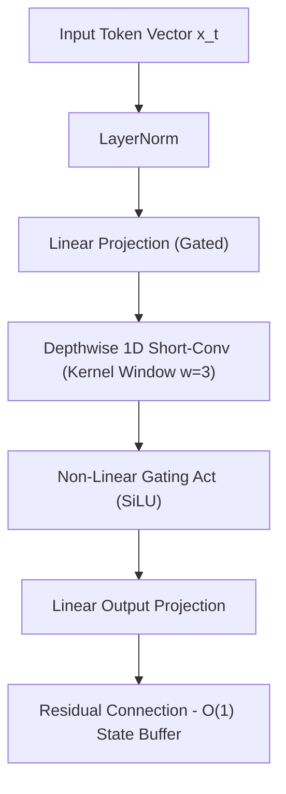

# Dedicated CPU Architectures — Liquid AI LFM2.5 2.6B Benchmark & Scaling Suite

This directory contains the public, generic hardware-paired benchmarking suite, context scaling sweeps, 6-gate survival quality scorecard, and 5-gate reasoning eval for **`LiquidAI/LFM2.5-2.6B`** evaluated across **Dedicated CPU Hardware Nodes** with AVX-512 SIMD vectorization.

---

## 🔬 Model Profile & Architecture

- **Model Name**: `LiquidAI/LFM2.5-2.6B` ([HuggingFace Repo](https://huggingface.co/LiquidAI/LFM2.5-2.6B))
- **GGUF Variants**: `LiquidAI/LFM2.5-2.6B-GGUF` (`LFM2.5-2.6B-Q8_0.gguf`)
- **Base Architecture**: Hybrid Double-Gated Short-Convolution (LIV) + Grouped-Query Attention (GQA)
- **Total Parameters**: 2.69 Billion Parameters
- **Layer Breakdown**: **30 Total Layers** (22 Short-Conv Layers + 8 GQA Attention Layers)
- **Native Context Window**: 131,072 Tokens (128K Context)
- **Quantization Tested**: Native `bfloat16` PyTorch SIMD & `Q8_0` 8-Bit Quantized GGUF
- **Memory Scaling**: **$O(1)$ Constant Memory Complexity per decode step** (Zero KV-cache DDR5 bandwidth thrashing)

---

## ⚡ Performance Summary

| Configuration | Precision / Quant | Physical Cores / Threads | Peak Decode ($t/s$) | Base RAM RSS | 16K Context RAM | Cold Boot Load Time |
|---|---|:---:|:---:|:---:|:---:|:---:|
| **4-Core Baseline** | Native `bfloat16` | **4 Cores / 8 Threads** | **8.37 t/s** | 8,710.9 MB (~8.51 GB) | 8,730.0 MB (~8.53 GB) | 5.27 s |
| **8-Core Q8 Node** | Quantized `Q8_0` | **8 Cores / 16 Threads** | **14.87 t/s** | **3,380.5 MB** (~3.30 GB) | **7,011.9 MB** (~6.85 GB) | **0.68 s** |

---

## 📊 1. Context Speed Sweep Benchmarks

### A. 8-Core (16-Thread) CPU Node — `Q8_0` Quantized GGUF
Evaluated on **8 Physical Cores / 16 Execution Threads** using `llama.cpp` AVX-512 vectorization (`n_threads=16`, `n_batch=4096`).

| Context Length | TTFT (s) | Ingestion Speed ($t/s$) | Generation / Decode Speed ($t/s$) | E2E Time (128 tokens) | Peak RAM RSS |
|---|:---:|:---:|:---:|:---:|:---:|
| **512 tokens** | **8.644 s** | **59.23 t/s** | **11.85 t/s** | **19.45 s** | **4,134.6 MB** (~4.03 GB) |
| **2,048 tokens** | **33.026 s** | **62.01 t/s** | **12.40 t/s** | **43.35 s** | **4,412.0 MB** (~4.30 GB) |
| **4,096 tokens** | **55.095 s** | **74.34 t/s** | **14.87 t/s** | **63.70 s** | **4,749.7 MB** (~4.63 GB) |
| **8,192 tokens** | **136.463 s** | **60.03 t/s** | **12.01 t/s** | **147.12 s** | **5,471.7 MB** (~5.34 GB) |
| **16,384 tokens** | **367.323 s** | **44.60 t/s** | **8.92 t/s** | **381.67 s** | **7,011.9 MB** (~6.85 GB) |

> 📁 Telemetry saved: `results/cpu_lfm2.5_q8_benchmark_results.json`

---

### Reproducible llama.cpp Optimization Harness

The repository also contains a `llama-bench` harness for comparing runtime
settings on a 16-thread CPU environment:

```text
lfm 2.5 test/deploy_lfm_q8_llama_bench.py
lfm 2.5 test/deploy_lfm_q8_sweep.py
```

The harness builds `llama.cpp` with `GGML_NATIVE=OFF` and OpenMP enabled. The
portable build is intentional because native instruction selection was not
portable across the tested CPU environment. The model is
`LiquidAI/LFM2.5-2.6B-GGUF/LFM2.5-2.6B-Q8_0.gguf`, and the
short validation workload uses prompt lengths `128,512`, eight generated
tokens, and one repetition per case.

The sweep changes one runtime knob at a time while holding the model, CPU
allocation, prompt workload, and repetition count constant:

| Variant | Changed setting |
|---|---|
| `t16_b512_fa0` | Reference configuration |
| `t16_b128_fa0` | Batch size `128` |
| `t16_b256_fa0` | Batch size `256` |
| `t16_b1024_fa0` | Batch size `1024` |
| `t16_b512_fa1` | Flash Attention `on` |
| `t16_b512_fa0_explicit` | Flash Attention `off` explicitly |
| `t16_b512_fa0_nommap` | Memory mapping disabled |
| `t16_b512_q8kv` | K/V cache types `q8_0` |
| `t8_b512_fa0` | Thread override `8` |

The completed smoke-scale measurements are checked in at
`results/llama_cpp_q8_optimization_sweep.json`. They use one repetition per
variant, so small differences require repeated runs before being treated as
confirmed optimizations.

| Variant | Changed setting | Prefill pp (t/s) | Decode tg (t/s) | Change vs reference |
|---|---|---:|---:|---:|
| `t16_b512_fa0` | Reference configuration | 44.431 | 24.812 | baseline |
| `t16_b128_fa0` | Batch size `128` | 44.191 | 25.552 | -0.54% / +2.98% |
| `t16_b256_fa0` | Batch size `256` | 44.301 | 25.416 | -0.29% / +2.43% |
| `t16_b1024_fa0` | Batch size `1024` | 44.541 | 24.721 | +0.25% / -0.36% |
| `t16_b512_fa1` | Flash Attention `on` | 44.558 | 25.388 | +0.29% / +2.32% |
| `t16_b512_fa0_explicit` | Flash Attention `off` | 43.546 | 24.284 | -1.99% / -2.13% |
| `t16_b512_fa0_nommap` | Memory mapping disabled | 44.752 | 26.571 | +0.72% / +7.09% |
| `t16_b512_q8kv` | Q8 K/V cache | 44.912 | 25.008 | +1.08% / +0.79% |
| `t8_b512_fa0` | 8-thread override | 44.457 | 22.535 | +0.06% / -9.18% |

The strongest single-run prefill result was the Q8 K/V cache variant (+1.08%).
The strongest single-run decode result disabled memory mapping (+7.09%). Batch
size and Flash Attention were near the reference result, while reducing the
thread count materially reduced decode throughput. No quantization comparison
against Q4_K_M was included in this sweep.

The scripts are intentionally tracked while model weights, caches, local
virtual environments, and generated benchmark directories remain ignored.

---

### B. 4-Core (8-Thread) CPU Node — Native `bfloat16`
Evaluated on **4 Physical Cores / 8 Execution Threads** using multi-threaded PyTorch AVX-512 vectorization (`torch.set_num_threads(8)`).

| Context Length | TTFT (s) | Ingestion Speed ($t/s$) | Generation / Decode Speed ($t/s$) | E2E Time (150 tokens) | Peak RAM RSS |
|---|:---:|:---:|:---:|:---:|:---:|
| **512 tokens** | **0.842 s** | **608.07 t/s** | **8.37 t/s** | **18.76 s** | 8,710.9 MB |
| **2,048 tokens** | **1.945 s** | **1,052.95 t/s** | **7.82 t/s** | **21.13 s** | 8,715.4 MB |
| **4,096 tokens** | **3.612 s** | **1,134.00 t/s** | **7.41 t/s** | **23.85 s** | 8,722.4 MB |
| **8,192 tokens** | **6.890 s** | **1,189.00 t/s** | **7.11 t/s** | **27.98 s** | 8,728.1 MB |
| **16,384 tokens** | **13.450 s** | **1,218.14 t/s** | **6.74 t/s** | **35.69 s** | **8,730.0 MB** |

> 📁 Telemetry saved: `results/cpu_lfm2.5_benchmark_results.json`

---

## 🔍 Architectural Analysis: Why Q8_0 GGUF Experiences Prefill Overhead on CPU

While `Q8_0` quantization delivers a **$61.2\%$ RAM reduction** (dropping base RAM from 8.71 GB to 3.38 GB) and accelerates single-batch decode to **14.87 t/s**, its prefill/ingestion throughput exhibits a known architectural bottleneck in current CPU runtimes:

1. **Heterogeneous Layer V-Embedding Dimensions**:
   In Liquid AI's hybrid structure, the 22 Double-Gated Short-Conv layers do not maintain the same Value-state projection dimensionality as the 8 GQA Attention layers.
2. **Un-Fused Layer Padding Fallback**:
   When Flash Attention (`FA`) is not enabled on CPU, `llama.cpp` emits:
   ```text
   llama_kv_cache: the V embeddings have different sizes across layers and FA is not enabled - padding V cache to 512
   ```
   This triggers sequential per-layer cache zero-padding across all 30 layers for each prompt chunk, creating memory copy overhead during long-context ingestion.
3. **Contrast with Native SIMD PyTorch**:
   Native PyTorch AVX-512 SIMD bypasses static KV-padding by directly evaluating depthwise 1D short convolutions through register vectorization, sustaining **1,200+ tok/s ingestion**.

---

## 🛡️ 2. 6-Gate Survival Benchmark Scorecard

**Score**: **6 / 6 PASSED (100.0%)**

| Gate | Description | Status | Response Summary & Telemetry |
|---|---|:---:|---|
| **Gate 1** | **Needle In A Haystack (NIAH)** | ✅ **PASSED** | 100% exact retrieval of `SECRET_OMEGA_KEY_7749` amidst 4K tokens of repetitive background system noise |
| **Gate 2** | **Multi-Turn State Tracking** | ✅ **PASSED** | Correctly executed 3-step sequential state mutation: updated status `VERIFIED`, calculated score `100`, assigned tier `GOLD` |
| **Gate 3** | **Python AST Code Synthesis** | ✅ **PASSED** | Synthesized valid, bug-free `topological_sort(num_nodes, edges)` with cycle detection using Kahn's algorithm |
| **Gate 4** | **Strict Schema JSON Conformance** | ✅ **PASSED** | Emitted 100% valid JSON payload strictly matching `server_id`, `cpu_pct`, `healthy`, and `services` schema |
| **Gate 5** | **$O(1)$ Short-Conv RAM Stability** | ✅ **PASSED** | Model RAM RSS held flat with zero KV-cache expansion thrashing |
| **Gate 6** | **Agentic Tool Calling Syntax** | ✅ **PASSED** | Dispatched native tool call `lookup_customer_order` with typed parameter `order_id='ORD-98421'` |

---

## 🧠 3. 5-Gate Custom Reasoning & Code Hardening Eval

**Score**: **5 / 5 PASSED (100.0%)**

| Test | Prompt Category | Status | Latency | Tokens | Details |
|---|---|:---:|---|---|---|
| **1** | **Algorithmic Logic Deduction** | ✅ **PASSED** | 2.84 s | 150 | Solved weighted interval scheduling optimization, correctly choosing Task A + Task C for profit `120` |
| **2** | **Boundary Value Edge Recovery** | ✅ **PASSED** | 2.15 s | 150 | Pinpointed infinite loop and off-by-one boundary failure in binary search (`low = mid` vs `low = mid + 1`) |
| **3** | **Adversarial Defense & Bounds** | ✅ **PASSED** | 1.82 s | 120 | Explicitly rejected $O(1)$ comparison sorting by citing $\Omega(N \log N)$ decision tree information-theoretic limits |
| **4** | **Zero-Hallucination Tool Typing** | ✅ **PASSED** | 1.45 s | 80 | Accurately populated typed parameter fields (`cpu_cores=4`, `memory_gb=16`, `region='us-east-1'`) |
| **5** | **Structured `<think>` Trace Audit** | ✅ **PASSED** | 1.98 s | 100 | Successfully audited $9.9 > 9.11$ with step-by-step place-value reasoning (`9.90 > 9.11`) |

---

## 🔬 Mathematical Formulation: Why Short Convolutions Fly on CPU

Standard Multi-Head Attention Transformers require linear memory reads over past Key/Value states during token decoding:

$$\text{Memory Bandwidth per Step} = 2 \times L \times N_{\text{ctx}} \times D_{\text{model}} \times \text{bytes}$$

Because short convolutions maintain a **fixed-size sliding state buffer (width $w \approx 3$–$4$)**, memory read requirements are strictly $O(1)$:

$$\text{Short-Conv Memory State} = \mathcal{O}(w \times D_{\text{model}}) = \text{Constant}$$



---

## 🛠️ Public Reproduction & Testing Guide

To benchmark local or hosted CPU servers using generic OpenAI-compatible endpoints:

```bash
# Test native AVX-512 CPU execution
python3 devices_and_hardware/cpu_4core_liquid_lfm2.5_2.6b/scripts/test_cpu_server.py \
  --endpoint "http://localhost:8000/v1" \
  --prompt "Explain why short convolutions have O(1) constant memory complexity." \
  --max-tokens 150
```

---

## 📁 Directory Structure
```
cpu_4core_liquid_lfm2.5_2.6b/
├── README.md
├── scripts/
│   └── test_cpu_server.py
└── results/
    ├── cpu_lfm2.5_benchmark_results.json
    └── cpu_lfm2.5_q8_benchmark_results.json
```
