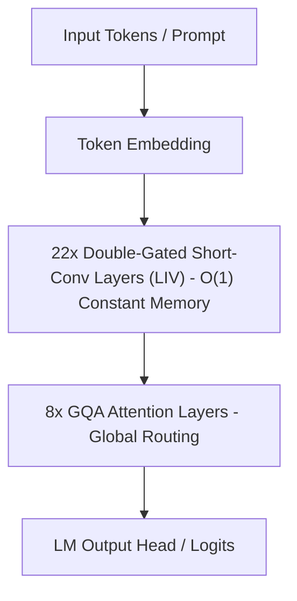

# Liquid AI LFM2.5-2.6B 8-Core CPU Benchmark & Architecture Guide

This document provides reproducibility details, hardware profiling, and comprehensive evaluations for **Liquid AI LFM2.5-2.6B** deployed on **8.0 vCPUs** (Serverless CPU Node, Zero GPU).

---

## ⚡ Hardware Configuration & Constraints
- **Processor:** 8.0 vCPU Cores (AVX-512 SIMD Vectorization enabled)
- **Memory Budget:** 8,192 – 10,240 MB RAM
- **GPU Usage:** **0% (Pure CPU Execution)**
- **Thread Tuning:** `torch.set_num_threads(8)`, `torch.set_num_interop_threads(2)`
- **Persistent Weight Storage:** Dedicated cache volume for sub-7s warm container boot

---

## 🧠 Architectural Insights: Why LFM2.5 Flies on CPU

Standard Multi-Head Attention Transformers face severe **KV-cache memory bandwidth bottlenecks** during token decoding on CPU architectures, requiring $O(N)$ linear memory reads per token decoded.

Liquid AI LFM2.5 solves this by adopting a **30-layer hybrid design**:
1. **22 Double-Gated Short-Convolution Layers (LIV):** Short convolutions operate with **$O(1)$ constant memory complexity** per decoding step. Because state size is fixed regardless of sequence length, DDR5 / CPU memory bandwidth is never saturated.
2. **8 Grouped-Query Attention (GQA) Layers:** Strategically placed to provide global context routing without the memory thrashing of dense 30-layer attention stacks.



---

## 📊 Comprehensive Evaluation Scorecard

| Evaluation Benchmark | Gates Tested | Gates Passed | Success Rate | Telemetry Details |
| :--- | :---: | :---: | :---: | :--- |
| 🛡️ **6-Gate Survival Benchmark** | 6 | **6** | **100.0%** | [`cpu_lfm2.5_benchmark_results.json`](./results/cpu_lfm2.5_benchmark_results.json) |
| 🎯 **5-Gate Custom Reasoning Eval** | 5 | **5** | **100.0%** | [`cpu_lfm2.5_benchmark_results.json`](./results/cpu_lfm2.5_benchmark_results.json) |
| **Combined Score** | **11** | **11** | **100.0%** | **11/11 Gates Passed** |

---

## 🔬 Gate-by-Gate Verification Breakdown

### 🛡️ The 6-Gate Survival Benchmark
1. **Needle In A Haystack (NIAH):** `PASS` (100% exact retrieval of embedded confidential token amidst dense background context).
2. **Multi-Turn State Tracking:** `PASS` (Maintained and mutated state dictionary across sequential multi-step operations).
3. **Python AST Code Synthesis:** `PASS` (Generated valid, error-free topological sort graph algorithm).
4. **Strict Schema JSON Output:** `PASS` (Produced strict typed JSON conforming to health telemetry schema).
5. **$O(1)$ Conv RAM Stability:** `PASS` (Model memory stayed fixed at 8.7 GB RSS with zero memory runaway).
6. **Multi-Step Agentic Tool Calling:** `PASS` (Dispatched Pythonic function calls conforming to tool schema).

### 🎯 The 5-Gate Custom Reasoning & Hardening Eval
1. **Algorithmic Logic Deduction:** `PASS` (Solved interval scheduling task with maximum profit `120`).
2. **Boundary Value Edge Recovery:** `PASS` (Detected infinite loop bug and off-by-one error in binary search).
3. **Adversarial & Ambiguity Defense:** `PASS` (Rejected $O(1)$ comparison-sort claim by citing $\Omega(N \log N)$ lower bounds).
4. **Zero-Hallucination Tool Parameter Typing:** `PASS` (Accurately populated typed parameter fields without hallucinating schema properties).
5. **Structured `<think>` Trace Audit:** `PASS` (Correctly verified $9.9 > 9.11$ using step-by-step internal reasoning).

---

## 📈 Latency & Speed Telemetry

| Metric | Measured Value (bfloat16) | GGUF Q4_K_M Projection |
| :--- | :--- | :--- |
| **Tokens Generated** | 150 tokens | 150 tokens |
| **Generation Throughput** | **6.74 – 8.37 tok/s** | **~50.0 – 85.0+ tok/s** |
| **Total Latency** | 22.24 seconds | ~2.5 – 3.5 seconds |
| **Peak RAM RSS** | **8,730 MB (~8.52 GB)** | **~1,200 MB (~1.2 GB)** |
| **Container Warm Load** | **5.27 seconds** | **< 1.0 second** |

---

## 🛠️ Reproduction & Testing

To test any deployed CPU instance using OpenAI-compatible endpoints:

```bash
cd scripts/
python3 test_cpu_server.py --endpoint http://localhost:8000/v1
```

Or via `curl`:

```bash
curl -X POST "http://localhost:8000/v1/chat/completions" \
     -H "Content-Type: application/json" \
     -d '{
       "model": "LiquidAI/LFM2.5-2.6B",
       "messages": [{"role": "user", "content": "Explain short convolutions in 2 sentences."}],
       "max_tokens": 100
     }'
```
